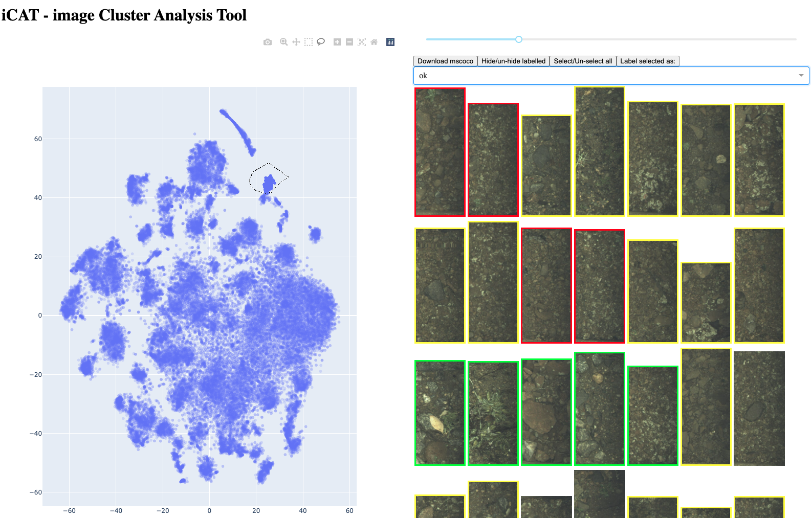

# ICAT: Image Cluster Annotation Tool
A tool for exploring and labelling images that have been clustered.


  

### Instruction
- make a npz-file with clusters with the following fields
  - 'files': list with path to images (stored as jpegs, pngs, etc. )
  - "xy": a Nx2 array of floats with positions of the images in cluster space
  - Install requirements
```
pip install -r requirements.txt
```
- Run icat:
```
python icat.py -f YOUR_FILE_WITH_DATA.npz
```

- For more help run:
```
python icat.py -h
```

#### TODOS:
- Select lasso on startup (but not being continously reloaded)
